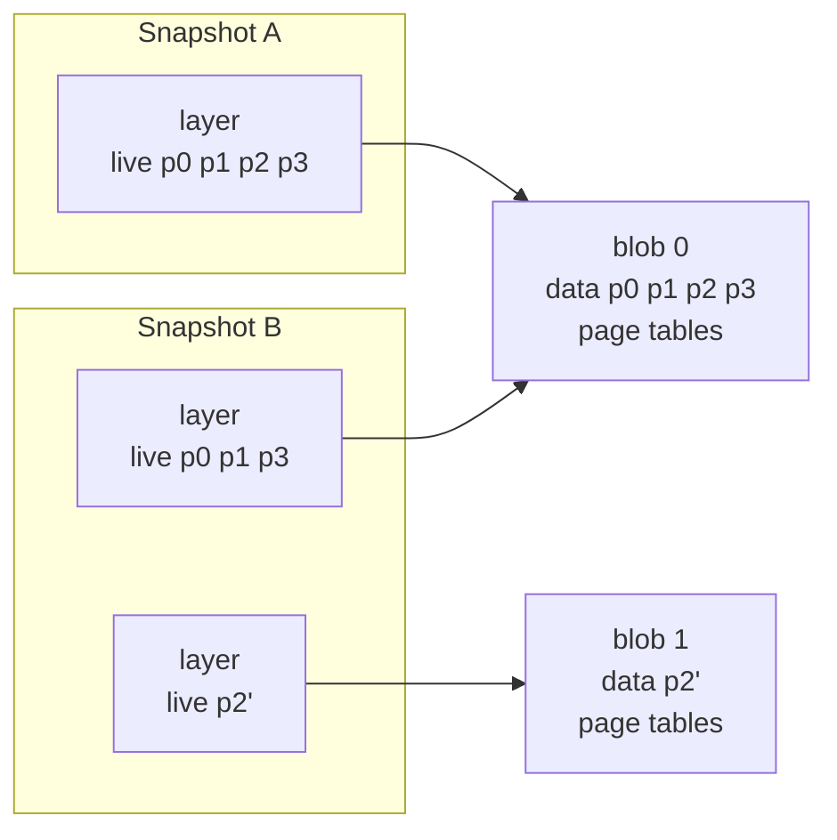

# HIP 0003 - Incremental snapshots

## Summary

Currently, taking a snapshot of a sandbox copies all of the memory of the
sandbox into a new snapshot. It does this even when the guest modified very few
pages since the parent snapshot. This is:

1. slow, since copying memory is slow, especially for big sandboxes
2. memory intensive, since unmodified data is duplicated across snapshots

Incremental snapshots correct this. A snapshot instead holds a list of
immutable layers. Each layer has one shared read-only blob, and the live guest
address ranges that the layer gives.

An incremental snapshot points at the blobs of the parent and adds one new
layer. That layer holds the data that changed, and the page tables for a
restore. Sharing a blob costs one cloned `Arc`, because a blob is read-only.
Thus a snapshot stores the changes only, which lowers memory use and makes a
snapshot faster to take.

## Motivation

A common pattern is one base snapshot for all customers. The base snapshot
holds the initial state of the sandbox, which is the same for every customer.
In hyperlight-wasm it holds the WebAssembly runtime. When a request comes in,
the host restores the base snapshot, adds the state of that customer, for
example a WebAssembly module, and then runs the code of the customer.

Caching a snapshot for the top N customers would remove that work from most
requests. The memory cost makes this impractical today, because every snapshot
stores a full copy of the sandbox memory. N cached customers means N copies of
the WebAssembly runtime, while the customer state is a small fraction of each
one.

With incremental snapshots, a customer snapshot holds only the pages that the
state of the customer changed. All N snapshots share the blob of the base
snapshot. Thus the cache costs the size of the base snapshot and the sum of the
changes, and the host can keep many more customers in memory.

## Proposal

### Data model

A guest of four pages. Snapshot A is the parent. The guest then writes page 2,
and snapshot B is taken.

Snapshot B keeps the layer of snapshot A, but the live ranges of that layer do
not hold page 2. Both snapshots share blob 0. Only page 2 is a copy.

* A `SnapshotMemory` has the layers of one snapshot, in the sequence of their
  guest physical address. It also has the index of the layer that gives the
  page tables for a restore.
* A `SnapshotLayer` has one blob and the ranges in that blob that the layer
  gives. Each layer has its own ranges. Layers in different snapshots can share
  a blob.
* A `SnapshotBlob` is immutable storage. It holds guest data and then page
  tables. Either part can be absent. All snapshots that use this data share the
  blob.

The live ranges of the layers do not overlap. Thus at most one layer holds each
address, and a lookup does a binary search.

The snapshots make a tree. A sandbox can restore any snapshot and then make
more snapshots from it. Snapshots with the same parent share the blobs of that
parent. No snapshot points to its parent, because each one has the full list of
its layers. Thus you can delete one snapshot, and the others keep the blobs
that they use.

### Taking a Snapshot of a Sandbox

1. Find the pages that this snapshot must save. Read the guest page tables to
   get all the mapped pages. A page whose guest physical address is in a live
   range of a layer is already in a previous snapshot, and this snapshot shares
   it. All other pages must be saved.
2. Find a place in the guest address space for the new pages. The new blob must
   not overlap the layers that this snapshot keeps. Use the first unused part
   that is large enough.
3. Save the new pages in a new blob. Copy them into the blob, then write the
   page tables after them. A saved page gets a new address in the blob, thus
   the page tables are built again. A shared page keeps its address.
4. Make the list of layers. The new blob is one layer, and it gives the page
   tables for a restore. This snapshot keeps each parent layer that still gives
   at least one page, without the pages that moved into the new blob. It drops
   a parent layer that gives no page.

### Restoring a Sandbox to a Snapshot

Only the mapping step changes. Before, a restore replaced one memory region
with the flat memory of the snapshot. Now it compares the current VM mappings
with the live ranges of the snapshot. It unmaps the regions that the snapshot
does not have, and maps the regions that the VM does not have. Mappings that
both have stay in place, thus a restore between snapshots that share layers
moves only the difference.

The other steps stay the same. A restore still removes the regions that
`map_region` and `map_file_cow` added, zeroes the scratch memory, copies the
page tables of the snapshot into scratch, and resets the vCPU.

### Limits

A snapshot has one VM memory mapping for each live range of each of its layers.
Mapping or unmapping one is a hypervisor call. A restore changes only the
mappings that differ, but that can be all of them, so an unbounded number of
live ranges would make a restore arbitrarily slow. A snapshot therefore has a
fixed cap on its total mappings, and taking a snapshot above the cap fails.
Every layer except the one with the restore page tables must give at least one
live range, so the cap bounds the layer count too.

### Snapshots on Disk

This builds on the OCI image format that snapshots already use. The image has
one layer file per blob, named by its sha256. The config lists the layers,
their live ranges, and which layer gives the restore page tables. The writer
emits the version 2 config and memory media types. The loader still accepts
version 1 images, and makes their single blob one layer. Thus old snapshots
still load.

#### Limitations

* Snapshots on disk only share blobs if they are saved in the same directory.
  That directory is the `path` of `Snapshot::save`, or the target of
  `oras cp --to-oci-layout <ref> <dir>:<tag>`.

