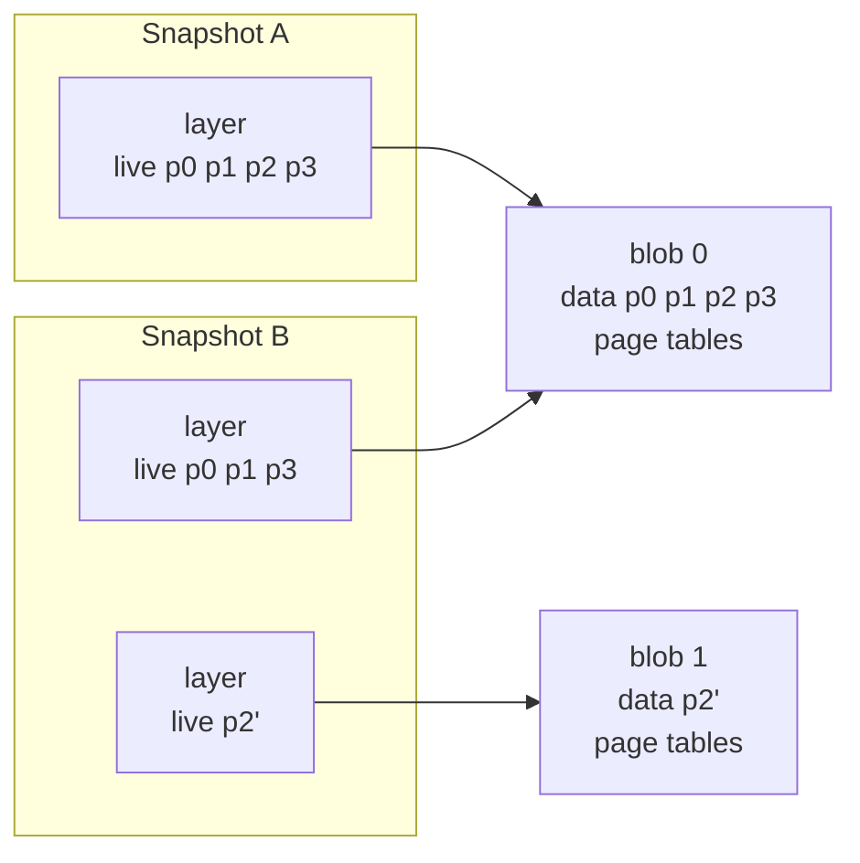

# HIP 0003 - Incremental snapshots

## Summary

Currently, taking a snapshot of a sandbox copies all of the memory of the
sandbox into a new snapshot. It does this even when the guest modified very few
pages since the parent snapshot. This is:

1. slow, since copying memory is slow, especially for big sandboxes
2. memory intensive, since unmodified data is duplicated across snapshots

Incremental snapshots correct this. A snapshot instead holds a list of
immutable layers. Each layer has one shared read-only blob, and the live guest
address ranges that the layer gives.

An incremental snapshot points at the blobs of the parent and adds one new
layer. That layer holds the data that changed, and the page tables for a
restore. Sharing a blob costs one cloned `Arc`, because a blob is read-only.
Thus a snapshot stores the changes only, which lowers memory use and makes a
snapshot faster to take.

## Motivation

A common pattern is one base snapshot for all customers. The base snapshot
holds the initial state of the sandbox, which is the same for every customer.
In hyperlight-wasm it holds the WebAssembly runtime. When a request comes in,
the host restores the base snapshot, adds the state of that customer, for
example a WebAssembly module, and then runs the code of the customer.

Caching a snapshot for the top N customers would remove that work from most
requests. The memory cost makes this impractical today, because every snapshot
stores a full copy of the sandbox memory, despite the specific customer state
is a small fraction of each one.

With incremental snapshots, a customer snapshot holds only the pages that the
state of the customer changed. All N snapshots share the blob of the base
snapshot. Thus the cache costs the size of the base snapshot and the sum of the
changes, and the host can keep many more customers in memory.

## Proposal

### Data model

A guest of four pages. Snapshot A is the parent. The guest then writes page 2,
and snapshot B is taken.



Snapshot B keeps the layer of snapshot A, but the live ranges of that layer do
not hold page 2. Both snapshots share blob 0. Only page 2 is a copy.

* A `SnapshotMemory` has the layers of one snapshot, in the sequence of their
  guest physical address. It also has the index of the layer that gives the
  page tables for a restore.
* A `SnapshotLayer` has one blob and the ranges in that blob that the layer
  gives. Each layer has its own ranges. Layers in different snapshots can share
  a blob.
* A `SnapshotBlob` is one immutable, contiguous block of host memory. It has two
  parts, guest data and page tables. All snapshots that use this data share the
  blob. A blob has no data
  when every mapped page is already in a live range, for example when the host
  calls `map_region` or `map_file_cow` and then takes a snapshot. Every layer
  contains page tables, but only the last layer's page tables are needed for a
  restore.

The data ranges of the blobs do not overlap, thus at most one layer holds each
address. The layers are sorted by the start address of their data range. A
lookup can then binary search them, and a new blob can take the first gap that
is large enough.

The snapshots make a tree. A sandbox can restore any snapshot and then make
more snapshots from it. Snapshots with the same parent share the blobs of that
parent.

### Taking a Snapshot of a Sandbox

1. Find the pages that this snapshot must save. Read the guest page tables to
   get all the mapped pages. A page whose guest physical address is in a live
   range of a layer is already in a previous snapshot, and this snapshot shares
   it. All other pages must be saved.
2. Find a place in the guest address space for the new pages. The new blob must
   not overlap the layers that this snapshot keeps. Use the first unused part
   that is large enough.
3. Save the new pages in a new blob. Copy them into the blob, then write the
   page tables after them. A saved page gets a new address in the blob, thus
   the page tables are built again. A shared page keeps its address.
4. Make the list of layers. The new blob is one layer, and it gives the page
   tables for a restore. This snapshot keeps each parent layer that still gives
   at least one page. Such a layer keeps its blob, and its live ranges lose the
   pages that moved into the new blob. This snapshot drops a parent layer that
   gives no page.

### Restoring a Sandbox to a Snapshot

Only the mapping step changes. Before, a restore replaced one memory region
with the flat memory of the snapshot. Now it compares the current VM mappings
with the live ranges of the snapshot. It unmaps the regions that the snapshot
does not have, and maps the regions that the VM does not have. Mappings that
both have stay in place, thus a restore between snapshots that share layers
moves only the difference.

The other steps stay the same. A restore still removes the regions that
`map_region` and `map_file_cow` added, zeroes the scratch memory, copies the
page tables of the snapshot into scratch, and resets the vCPU.

### Limits

A snapshot has one VM memory mapping for each live range of each of its layers.
Mapping or unmapping one is a hypervisor call. A restore changes only the
mappings that differ, but that can be all of them, so an unbounded number of
live ranges would make a restore arbitrarily slow. A snapshot therefore has a
fixed cap on its total mappings, and taking a snapshot above the cap fails.
Every layer except the one with the restore page tables must give at least one
live range, so the cap bounds the layer count too.

The page tables in the layers before the last waste space, in memory and on
disk, unless the snapshot that created them is also kept.

### API

No public API changes, except `PtRootFinder`. It received the flat snapshot
buffer, which no longer exists, so it now receives a reader that takes a guest
physical address.

### Snapshots on Disk

This builds on the OCI image format that snapshots already use. The image has
one layer file per blob, named by its sha256. The config lists the layers,
their live ranges, and which layer gives the restore page tables. The writer
emits the version 2 config and memory media types. The loader still accepts
version 1 images, and makes their single blob one layer. Thus old snapshots
still load.

Each snapshot is one manifest that lists every blob it needs by digest. Two
snapshots that share a blob name the same digest. The layout stores that file
once.

Snapshot A and snapshot B saved to one directory:

```
index.json         tag a -> manifest A, tag b -> manifest B
blobs/sha256/<mA>  manifest A: config <cA>, layers <b0>
blobs/sha256/<mB>  manifest B: config <cB>, layers <b0> <b1>
blobs/sha256/<cA>  config A: layer 0 live p0 p1 p2 p3
blobs/sha256/<cB>  config B: layer 0 live p0 p1 p3, layer 1 live p2'
blobs/sha256/<b0>  blob 0
blobs/sha256/<b1>  blob 1
```

Deleting tag a leaves blob 0 in place, because manifest B still names it.

#### Limitations

* Blobs are shared inside one OCI layout, because that layout is the blob
  store. Saving the same snapshots to a second layout writes a second copy of
  each blob. The layout is the `path` of `Snapshot::save`, or the target of
  `oras cp --to-oci-layout <ref> <dir>:<tag>`.

## Alternatives considered

* Snapshot the scratch region in place, as the [sandbox images
  design](https://hackmd.io/Pgus9GO6TmyI1S1-T3GBxw) proposes. A snapshot copies
  the whole scratch region into a blob, and a restore maps that blob back as
  the scratch region. Incremental snapshots copy the changed pages out of
  scratch into a read-only blob, and a restore starts scratch empty. Rejected
  because:

  * Snapshots share the blob, so a guest write must not reach it. The host has
    to fault and copy each page the guest writes. Guest copy on write exists to
    avoid that exit per page.
  * Scratch has one fixed address, so a snapshot holds one scratch blob. A
    chain of snapshots needs a flatten at each step.
  * A sandbox gets two kinds of snapshot. A base holds the whole sandbox and
    restores with scratch empty. A diff holds a scratch region and restores on
    top of a base.

## Open questions

Should one blob hold both the guest data and the page tables?

For separate blobs: A snapshot carries only the page tables it restores from,
so it drops the page tables that its earlier layers waste. That saves memory
and disk, though page tables are small next to the data. Guest data and page
tables also become separate concerns with separate lifetimes, which makes the
code simpler. The layer types lose the index of the page table layer, and the
rule that every other layer must stay live.

For one blob: A future plan is for the guest to read the page tables from the
mapped blob, skipping the copy that a restore puts in scratch. A separate blob
would then need its own mapping, which costs one more mapping per snapshot and
two hypercalls per restore. This cost is hypothetical, because nothing maps the
page tables yet.

## Future work

An API to compact a snapshot would rebuild it as a single layer. The new layer
holds only the live pages, so the snapshot drops its dead pages and its extra
page tables. It also needs one mapping instead of many, which gives a long
chain room under the cap. This is out of scope for this HIP.
